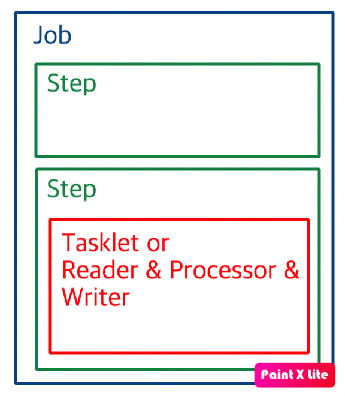

Spring Batch Tutorial
=====
> Spring framework에서 batch processing를 사용하고 공부하기 위해 만든 project입니다.

## Batch Components



- Job
    - 배치 처리 과정을 하나의 단위로 표현한 객체
    - 하나의 Job 안에는 여러 Step이 포함
    - JobBuilderFactory의 get()은 새로운 이름을 갖는 job을 새로 생성해서 반환
- Step
    - 실질적인 배치 처리를 정의하고 제어하는데 필요한 모든 정보가 있는 도메인 객체
    - Job 1개당 1개 이상의 Step이 필요 
    - Step 안에는 Tasklet or Reader & Processor & Writer 묶음이 존재 (하나를 선택)
- Tasklet
    - Step 안의 수행될 기능 명시
    - Step 안에서 단일로 수행될 커스텀한 기능(자유로 해당 STEP에서 하고 싶은 내용을 구현)

## Batch With Mysql

- Mysql을 Spring Batch와 함께 사용하기 위해 Meta Data가 있는 spring-batch db를 만들어줘야 됨 
    - Spring batch core의 schema-mysql.sql 참조 
 
- Meta Data Table
    - BATCH_JOB_INSTANCE
        - Job Param 단위로 Record 생성
        - Job Param이 같다면 생성이 안되며 Spring에서는 JobInstanceAlreadyCompleteException이 발생
    - BATCH_JOB_EXECUTION
        - JOB_EXECUTION(자식) - JOB_INSTANCE(부모) 관계
        - JOB_INSTNACE의 성공/실패 내역 모두 저장
            - JOB_INSTANCE와 달리 성공/실패를 모두 Record로 기록하여 동일 Job에 대해 복수의 Record 생성이 
            - JOB_EXECUTION이 COMPLETE해야 동일한 JOB이 수행 안됨
    - BATCH_JOB_EXECUTION_PARAMS
        - JOB_EXECUTION에 쓰인 Job Param 정보를 담고 있음
        
## Batch Job Step Flow Control

- Next
    - 순차적으로 일련의 Step을 연결하여 사용
    ```java
        jobBuilderFactory.get("batchJob")
            .start(step1())
            .next(step2())
            .next(step3())
            .build()
        // step1 -> step2 -> step3 순서로 실행
    ```
- Conditional
    - on(pattern: String) 
        - ExisStatus를 기반으로 listen한다.
    - to(step: Step)
        - 이동할 Step을 지정
    - from(step: Step)
        - start와 같이 base step의 리스터 역할 
        - start의 condition에 걸리지 않았는데 base step에서 다시 시작해야 할 때 사용
    - end()
        - 모든 Step을 종료하는 함수 or 해당 컨디션에서 다음 컨디션으로 넘어가기 위한 함수:wq